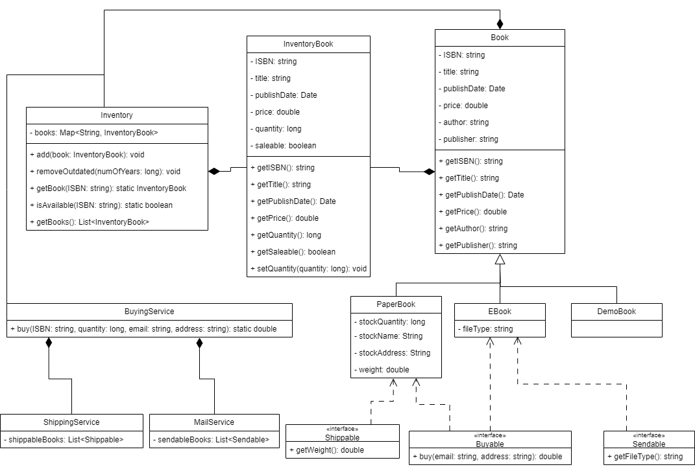

# Bookstore System

A Java-based Bookstore Management System developed as part of the Fawry internship Challenges. This project demonstrates object-oriented design principles, service abstraction, and inventory management for both physical and digital books.

## Features

- **Book Management**: Supports both paper books and e-books with shared and specific attributes.
- **Inventory System**: Track available books, manage stock, and handle purchases.
- **Service Abstraction**: Includes buying, shipping, and mail services for different book types.
- **Interface-driven Design**: Uses interfaces for buyable, shippable, and sendable entities.
- **Demo Application**: Main class demonstrates system usage and features.

## Class Diagram

The following diagram illustrates the main classes, interfaces, and their relationships:



## Project Structure

```
src/
  Main.java
  interfaces/
    Buyable.java
    Sendable.java
    Shippable.java
  models/
    Book.java
    DemoBook.java
    EBook.java
    Inventory.java
    InventoryBook.java
    PaperBook.java
  services/
    BuyingService.java
    MailService.java
    ShippingService.java
assets/
  bookstore-system-class_diagram.drawio.png
```

## Getting Started

1. **Clone the repository**
   ```sh
   git clone <repository-url>
   ```
2. **Navigate to the project directory**
   ```sh
   cd Bookstore-system-Fawry-internship
   ```
3. **Compile the project**
   ```sh
   javac -d bin src/**/*.java
   ```
4. **Run the application**
   ```sh
   java -cp bin Main
   ```

## Main Class Sample
```java
public class Main {
  public static void main(String[] args) {
    System.out.println("=== Bookstore System Test ===\n");

    // Create inventory
    Inventory inventory = new Inventory();

    // Test 1: Add books to inventory
    System.out.println("1. Testing ADD functionality:");
    testAddBooks(inventory);

    // Test 2: Test removeOutdated functionality
    System.out.println("\n2. Testing REMOVE OUTDATED functionality:");
    testRemoveOutdated(inventory);

    // Test 3: Test buy functionality
    System.out.println("\n3. Testing BUY functionality:");
    testBuyBooks(inventory);

    System.out.println("\n=== All tests completed ===");
  }

  private static void testAddBooks(Inventory inventory) {
    System.out.println("Adding books to inventory...");

    // Create sample books with different dates
    Calendar cal = Calendar.getInstance();

    // Recent book (2023)
    cal.set(2023, Calendar.JANUARY, 1);
    Date date2023 = cal.getTime();
    InventoryBook book1 = new InventoryBook("978-0134685991", "Effective Java", date2023, 45.99, true);
    inventory.add(book1);
    System.out.println("✓ Added: Effective Java (2023)");

    // Older book (2010)
    cal.set(2010, Calendar.MARCH, 15);
    Date date2010 = cal.getTime();
    InventoryBook book2 = new InventoryBook("978-0321334879", "Effective C++", date2010, 39.99, true);
    inventory.add(book2);
    System.out.println("✓ Added: Effective C++ (2010)");

    // Very recent book (2024)
    cal.set(2024, Calendar.JUNE, 10);
    Date date2024 = cal.getTime();
    InventoryBook book3 = new InventoryBook("978-1617294945", "Spring in Action", date2024, 49.99, true);
    inventory.add(book3);
    System.out.println("✓ Added: Spring in Action (2024)");

    // Add duplicate to test quantity increase
    InventoryBook book1Duplicate = new InventoryBook("978-0134685991", "Effective Java", date2023, 45.99, true);
    inventory.add(book1Duplicate);
    System.out.println("✓ Added duplicate: Effective Java (quantity should increase)");

    // Check book availability
    System.out.println("\nChecking book availability:");
    System.out.println("Effective Java available: " + Inventory.isAvailable("978-0134685991"));
    System.out.println("Effective C++ available: " + Inventory.isAvailable("978-0321334879"));
    System.out.println("Spring in Action available: " + Inventory.isAvailable("978-1617294945"));
    System.out.println("Effective Java quantity: " + Inventory.getBook("978-0134685991").getQuantity());
  }

  private static void testRemoveOutdated(Inventory inventory) {
    System.out.println("Testing removeOutdated with 10 years threshold...");

    System.out.println("Before removal:");
    System.out.println("Effective Java (2023) available: " + Inventory.isAvailable("978-0134685991"));
    System.out.println("Effective C++ (2010) available: " + Inventory.isAvailable("978-0321334879"));
    System.out.println("Spring in Action (2024) available: " + Inventory.isAvailable("978-1617294945"));

    // Remove books older than 10 years (should remove the 2010 book)
    inventory.removeOutdated(10);

    System.out.println("\nAfter removing books older than 10 years:");
    System.out.println("Effective Java (2023) available: " + Inventory.isAvailable("978-0134685991"));
    System.out.println("Effective C++ (2010) available: " + Inventory.isAvailable("978-0321334879"));
    System.out.println("Spring in Action (2024) available: " + Inventory.isAvailable("978-1617294945"));

    // Test with 5 years threshold
    System.out.println("\nTesting removeOutdated with 5 years threshold...");
    inventory.removeOutdated(5);

    System.out.println("After removing books older than 5 years:");
    System.out.println("Effective Java (2023) available: " + Inventory.isAvailable("978-0134685991"));
    System.out.println("Spring in Action (2024) available: " + Inventory.isAvailable("978-1617294945"));
  }

  private static void testBuyBooks(Inventory inventory) {
    // Add fresh books for buying test
    Calendar cal = Calendar.getInstance();
    cal.set(2024, Calendar.JANUARY, 1);
    Date date2024 = cal.getTime();

    InventoryBook testBook = new InventoryBook("978-1234567890", "Test Book for Purchase", date2024, 29.99, true);
    inventory.add(testBook);
    inventory.add(testBook); // Add again to have quantity = 2

    System.out.println("Added test book with quantity: " + Inventory.getBook("978-1234567890").getQuantity());

    // Test successful purchase
    System.out.println("\nTesting successful purchase:");
    try {
      double price = BuyingService.buy("978-1234567890", 1, "test@example.com", "123 Test St");
      System.out.println("Purchase successful! Price: $" + price);
      System.out.println("Remaining quantity: " + Inventory.getBook("978-1234567890").getQuantity());
    } catch (Exception e) {
      System.out.println("Purchase failed: " + e.getMessage());
    }

    // Test purchasing remaining stock
    System.out.println("\nTesting purchase of remaining stock:");
    try {
      double price = BuyingService.buy("978-1234567890", 1, "test@example.com", "123 Test St");
      System.out.println("Purchase successful! Price: $" + price);
      System.out.println("Book still available: " + Inventory.isAvailable("978-1234567890"));
    } catch (Exception e) {
      System.out.println("Purchase failed: " + e.getMessage());
    }

    // Test purchasing unavailable book
    System.out.println("\nTesting purchase of unavailable book:");
    try {
      double price = BuyingService.buy("978-1234567890", 1, "test@example.com", "123 Test St");
      System.out.println("Purchase successful! Price: $" + price);
    } catch (Exception e) {
      System.out.println("Purchase failed: " + e.getMessage());
    }

    // Test purchasing with insufficient stock
    System.out.println("\nTesting purchase with insufficient stock:");
    InventoryBook limitedBook = new InventoryBook("978-9876543210", "Limited Stock Book", date2024, 19.99, true);
    inventory.add(limitedBook); // Only 1 in stock

    try {
      double price = BuyingService.buy("978-9876543210", 3, "test@example.com", "123 Test St");
      System.out.println("Purchase successful! Price: $" + price);
    } catch (Exception e) {
      System.out.println("Purchase failed: " + e.getMessage());
    }
  }
}
```

## Sample Output
```
=== Bookstore System Test ===

1. Testing ADD functionality:
Adding books to inventory...
Added: Effective Java (2023)
Added: Effective C++ (2010)
Added: Spring in Action (2024)
Added duplicate: Effective Java (quantity should increase)

Checking book availability:
Effective Java available: true
Effective C++ available: true
Spring in Action available: true
Effective Java quantity: 2

2. Testing REMOVE OUTDATED functionality:
Testing removeOutdated with 10 years threshold...
Before removal:
Effective Java (2023) available: true
Effective C++ (2010) available: true
Spring in Action (2024) available: true

After removing books older than 10 years:
Effective Java (2023) available: true
Effective C++ (2010) available: false
Spring in Action (2024) available: true

Testing removeOutdated with 5 years threshold...
After removing books older than 5 years:
Effective Java (2023) available: true
Spring in Action (2024) available: true

3. Testing BUY functionality:
Added test book with quantity: 2

Testing successful purchase:
Purchase successful! Price: $29.99
Remaining quantity: 1

Testing purchase of remaining stock:
Purchase successful! Price: $29.99
Book still available: false

Testing purchase of unavailable book:
Purchase failed: The Book is not Available Or it is not for sale

Testing purchase with insufficient stock:
Not enough stock for book: Limited Stock Book
Purchase successful! Price: $19.99

=== All tests completed ===
```
